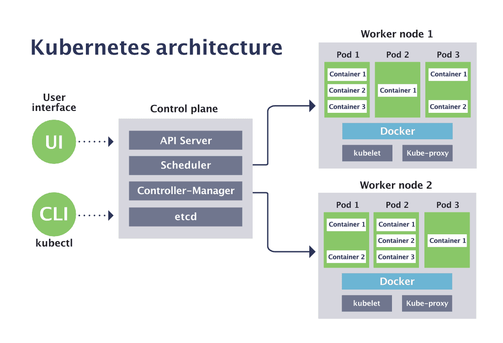
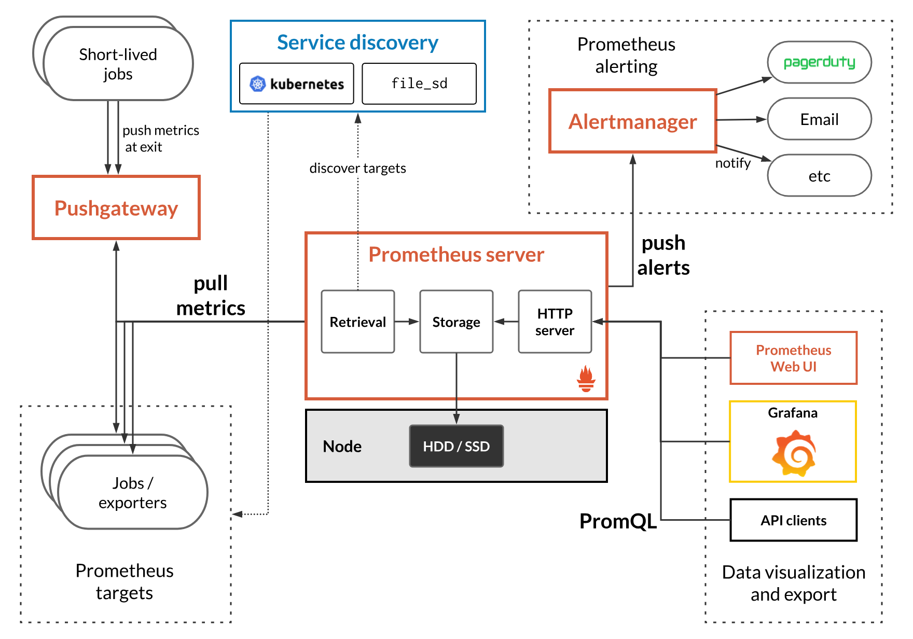

layout: true

.signature[@algogrit]

---

class: center, middle

# Kubernetes for Application Developers

Gaurav Agarwal

---

# Agenda

- Kubernetes is a *Silver Bullet*

---

class: center, middle


Software Engineer & Product Developer

Director of Engineering & Founder @ https://codermana.com

ex-Tarka Labs, ex-BrowserStack, ex-ThoughtWorks

---

## As a instructor

- I promise to

  - make this class as interactive as possible

  - use as many resources as available to keep you engaged

  - ensure everyone's questions are addressed

---

## What I need from you

- Be vocal

  - Let me know if there any audio/video issues ASAP

  - Feel free to interrupt me and ask me questions

- Give feedback

- Work on the exercises

- Be *on mute* unless you are speaking

---
class: center, middle

## Class progression


---
class: center, middle

Here you are trying to *learn* something, while here your *brain* is doing you a favor by making sure the learning doesn't stick!

---

### Some tips

- Slow down => stop & think
  - listen for the questions and answer

- Do the exercises
  - not add-ons; not optional

- There are no dumb questions!

- Drink water. Lots of it!

---

### Some tips (continued)

- Take notes
  - Try: *Repetitive Spaced Out Learning*

- Talk about it out loud

- Listen to your brain

- *Experiment!*

---
class: center, middle

### 📚 Content ` > ` 🕒 Time

---
class: center, middle

## Show of hands

*Yay's - in Chat*

---
class: center, middle

# Defining the problem

---
class: center, middle

## Thought Experiment: [Search Engine](https://github.com/AgarwalConsulting/K8s4Devs-Training/blob/master/Problem.md)

---

class: center, middle

### Building an application in a microservice architecture

---
class: center, middle

#### [12 Factor](https://12-factor-apps.slides.algogrit.com/) Apps

---
class: center, middle

## K8s vs EC2

---

- cluster of machines
- From ~10 to millions of microservices
- Manage/Share resources efficiently
  - Memory
  - CPU
  - Storage
  - GPU
  - ...
- Fault Tolerance
  - Healing & resiliency
- Isolation
- Networking
  - Service Discovery
- Managing Deployment
- Auto-Scaling
- ...

---
class: center, middle

# Architecture


---
class: center, middle

## Components

---

- Control Plane

- Worker Plane / Nodes

- Addons

---
class: center, middle

### Control Plane Components

Control plane components can be run on any machine in the cluster. However, for simplicity, set up scripts typically start all control plane components on the same machine, and do not run user containers on this machine.

---
class: center, middle

### Worker Plane components - Nodes

Node components run on every node, maintaining running pods and providing the Kubernetes runtime environment.

---
class: center, middle

### Addons

Addons use Kubernetes resources (DaemonSet, Deployment, etc) to implement cluster features.

---
class: center, middle

# Command Line Tools

---

## `kubectl`

- The `kubectl` command line tool lets you control Kubernetes clusters.

- For configuration, kubectl looks for a file named `config` in the `$HOME/.kube` directory.

- You can specify other kubeconfig files by setting the `KUBECONFIG` environment variable or by setting the `--kubeconfig` flag.

- Makes it reasonably easy to work with multiple clusters using: `kubectl config` & `contexts`

.content-credits[https://kubernetes.io/docs/reference/kubectl/overview/]

---
class: center, middle

## Other Tools: `awscli` & `eksctl`

---
class: center, middle



.image-credits[https://www.cncf.io/blog/2019/08/19/how-kubernetes-works/]

---
class: center, middle

## [Lab Access & Setup](https://github.com/AgarwalConsulting/K8s4Devs-Training/blob/master/Setup.md)

---
class: center, middle


---
class: center, middle

## EKS vs self-managed cluster

---
class: center, middle

So, let's get on with it...

---
class: center, middle

# Basics

---
class: center, middle

## Cluster Computing

---
class: center, middle

### Nodes

`Node = machine`

---

- Kubernetes runs your workload by placing containers into Pods to run on Nodes.
- A node may be a virtual or physical machine, depending on the cluster.
- Each node contains the services necessary to run Pods, managed by the control plane.

#### Useful commands

- `kubectl get nodes`
- `-o wide` for more information
- `kubectl describe`

---
class: center, middle

### Running our first container on a Kubernetes cluster

---
class: center, middle

`kubectl run --image=agarwalconsulting/fib-gen fibonacci`

---
class: center, middle

## Workloads

---
class: center, middle

### Pods

---

- Pods are the smallest deployable units of computing that can be created and managed in Kubernetes.

- A Pod *(as in a pod of whales or pea pod)* is a group of one or more containers *(such as Docker containers)*, with shared storage/network, and a specification for how to run the containers.

- A Pod always runs on a Node.

- Every pod gets a unique IP.

- If multiple containers per pod, pods can communicate with localhost.

#### Useful `kubectl` commands

- `kubectl get pods -o`
- `kubectl describe pods`
- `kubectl logs -f <name>`
- `kubectl exec`
- `kubectl delete pod <name>`

---
class: center, middle

#### Relation between Pods and containers


---
class: center, middle

#### Relation between Nodes and Pods


---
class: center, middle

### Controllers

---

- In general, users shouldn't need to create Pods directly.
  *You will rarely interact directly with pods, except perhaps viewing logs. You will interact with Deployments or ReplicaSets instead.*

- They should almost always use controllers even for singletons, for example, Deployments.

- Controllers provide self-healing with a cluster scope, as well as replication and rollout management.

- Controllers like StatefulSet can also provide support to stateful Pods.

---

#### Natively Supported Controllers (`kind` field)

- ReplicaSet
- ReplicationController
- Deployments
- StatefulSets
- DaemonSet
- Jobs
- ...

---
class: center, middle

#### Controller Spec generators

`kubectl create --dry-run=client -o yaml`

---

##### [Supported](https://kubernetes.io/docs/reference/kubectl/conventions/#generators) Generators

```csv
clusterrole         Create a ClusterRole.
clusterrolebinding  Create a ClusterRoleBinding for a particular ClusterRole.
configmap           Create a configmap from a local file, directory or literal value.
cronjob             Create a cronjob with the specified name.
deployment          Create a deployment with the specified name.
job                 Create a job with the specified name.
namespace           Create a namespace with the specified name.
poddisruptionbudget Create a pod disruption budget with the specified name.
priorityclass       Create a priorityclass with the specified name.
quota               Create a quota with the specified name.
role                Create a role with single rule.
rolebinding         Create a RoleBinding for a particular Role or ClusterRole.
secret              Create a secret using specified subcommand.
service             Create a service using specified subcommand.
serviceaccount      Create a service account with the specified name.
```

---
class: center, middle

#### [ReplicaSet](https://kubernetes.io/docs/concepts/workloads/controllers/replicaset/)

---

- We don’t want to manage pods directly, because they’re mortal.

- Instead we work with *replicasets* to manage the creation and replacement of pods.

- With a *replicaset*, any pods that die will be recreated to maintain the minimum number.

- This is essentially our pod declaration with some additional meta data.

---
class: center, middle

##### [Labels & Selectors](https://kubernetes.io/docs/concepts/overview/working-with-objects/labels/)

---

- Labels are key/value pairs that are attached to objects, such as pods.

- Selectors are used by controllers/services to identify pods to work with.

- Via a label selector, the client/user can identify a set of objects. The label selector is the core grouping primitive in Kubernetes.

---
class: center, middle

*Demo*: Defining a replicaset for `fibonacci`

---
class: center, middle


---

##### How does it work

So what component in Kubernetes makes sure the specified number of replica pods are running? The answer shows the elegance of Kubernetes’ architecture.

- The [`ReplicationController`](https://kubernetes.io/docs/concepts/workloads/controllers/replicationcontroller/) (which is the logic behind the ReplicaSet resource) is always watching the K8s API. When it sees that the number of running pods differs from the ReplicaSet’s configuration, it takes action. It tells K8s to launch pods to make up the gap. The ReplicationController’s job is now done.

- If there are too many pods, the ReplicationController terminates the extra pods. If there are too few, the ReplicationController starts more pods.

- The pod records are created in etcd.

- The scheduler now starts finding nodes for the pods to run.

- When a pod is assigned to a node, the kubelet on the assigned node takes action to start the pod on the node.

- A `ReplicaSet` ensures that a specified number of pod replicas are running at any given time.

---
class: center, middle

#### [Deployments](https://kubernetes.io/docs/concepts/workloads/controllers/deployment/)

---

- `Deployments` are an abstraction that creates ReplicaSets and manages pods being launched into different ones in a controlled way.

- They are declarative and you provide the end state. Kubernetes takes care of getting your pods to that end state in a managed way.

- On a rollout, K8S creates a new replicaset and starts moving pods to the new one in a controlled way, before removing the old replicaset.

- Note: deployments create a replicaset programmatically. Do not manage the replicaset directly!

- You can see rollout status with: `kubectl rollout status deployment nginx-deployment`

- You can see rollout history with: `kubectl rollout history deployment nginx-deployment`

- You can rollback with: `kubectl rollout undo deployment nginx-deployment`

- You can pause and resume rollouts

---

- RollingUpdate


---

#### Deployment Strategies

Choosing the right deployment procedure depends on the needs, listed below are some of the possible strategies to adopt:

- **Recreate**: terminate the old version and release the new one

- **RollingUpdate** or *ramped*: release a new version on a rolling update fashion, one after the other

.content-credits[https://blog.container-solutions.com/kubernetes-deployment-strategies]

---

#### Advanced Configuration: Deployments

- We can tweak the settings of Deployments to customize their behavior.

- In the `spec`, you can specify a `strategy` for replacing old pods with new ones. The options are `Recreate` or `RollingUpdate` (default).

- With `Recreate`, all old pods are killed off before the new ones are launched. This means you’ll experience downtime.

- For `RollingUpdate`, you can adjust the behavior.
  - `maxUnavailable` specifies how many pods can be unavailable at any time during rollout. You can specify absolute number or percentage. The default is 25%.
  - `maxSurge` is how many pods can be created over the replicas count. Can be absolute or percentage. The default is 25%.
  - `minReadySeconds` specifies a waiting period before a new Pod is considered ready. For a better solution, use Probes.

---
class: center, middle

### DaemonSet

---

- Runs a copy of the pod on every node in the cluster.

- Any new node will get a new copy of the pod.

- Any node removal cleans up the copy of the pod.

- Useful for system level resources such as monitoring, logging, etc.

- This is how the master pods on the worker nodes run, such as the kube-proxy and kubelet.

---
class: center, middle

### Stateful Set

---

- Works like a deployment, but provides guarantees about the order and uniqueness of pods

- Pods get a consistent naming scheme that is ordered. For example, pod-0, pod-1, pod-2, etc.

- The spec is identical, except for the Kind statement

- Stable, persistent storage

- Not typical. You should aim for stateless components if possible and use Deployments instead.

- Useful when you have a group of servers that work together and need to know each others’ names ahead of time.

- For example, we could create an ElasticSearch cluster that uses StatefulSets.

---
class: center, middle

## Example eCommerce Application: [`RVStore`](https://github.com/AgarwalConsulting/rvstore)

.content-credits[https://github.com/AgarwalConsulting/rvstore/blob/master/services.md]

---
class: center, middle

## *Demo*: Deploying the RV store's Products application

.content-credits[https://github.com/AgarwalConsulting/K8s4Devs-Training/tree/master/challenges/rvstore]

---
class: center, middle

## Configuration

---

### `configmap`

- Containers often need several environment variables to function properly so that configuration is externalized. But passing in variables directly to containers is messy.

- A ConfigMap is an API object used to store non-confidential data in key-value pairs.

- Pods can consume ConfigMaps as environment variables, command-line arguments, or as configuration files in a volume.

- This also allows you to reuse configurations.

---

### `secrets`

- How do you store sensitive information? Should you include it in a Docker image? How about in a pod spec? Never!

- Secrets are small pieces of sensitive information that your pods can access at runtime. Think passwords, SSH keys, etc.

- Secrets are stored as volumes that your containers can access. Alternatively, they can be exposed as environment variables.

- When using kubectl get, you won’t see the contents of a secret.

- Note that secrets are still accessible to those with access directly to the cluster. They are meant to protect from including them in Docker images which are more portable. It is best to have secrets managed by a limited set of people who know how to keep them safe. And don’t just check them into source control alongside your resources.

- When secrets are updated, the containers automatically pick up the changes immediately.

---
class: center, middle

`kubectl port-forward ...`

---
class: center, middle

### Networking, Load Balancing & Discovery: [`service`](https://kubernetes.io/docs/concepts/services-networking/service/)

---

#### Overview

- An abstract way to expose an application running on a set of Pods as a network service.

- The service resource also lets you expose an application running in Pods to be reachable from outside your cluster.

- Containers within a Pod use networking to communicate via loopback.

---
class: center, middle

```bash
kubectl expose help # --dry-run=client -o yaml
```

---
class: center, middle

##### [ServiceTypes](https://kubernetes.io/docs/concepts/services-networking/service/#publishing-services-service-types)

ServiceTypes control the way in which a service is exposed.

---

- *ClusterIP*

- NodePort

- LoadBalancer

- ExternalName

---
class: center, middle

#### Exercise: Review & deploy the remaining RVStore applications

---

#### Exercise: Service continued

- Can we access the service from our own computer at `http://localhost:<node-port>`?

- Now go delete your pods and try the URL again. Is our service down?

---
class: center, middle

#### Endpoints

*Endpoints track the IP addresses of Pods with matching selectors.*

.content-credits[https://www.stackrox.io/blog/kubernetes-networking-demystified/]

---

#### Services without selectors

Services most commonly abstract access to Kubernetes Pods, but they can also abstract other kinds of backends. For example:

- You want to have an external database cluster in production, but in your test environment you use your own databases.

- You want to point your Service to a Service in a different Namespace or on another cluster.

- You are migrating a workload to Kubernetes. Whilst evaluating the approach, you run only a proportion of your backends in Kubernetes.

.content-credits[https://kubernetes.io/docs/concepts/services-networking/service/]

---
class: center, middle

*Demo*: Exposing an externally running service within the cluster

---
class: center, middle

#### [Ingress](https://kubernetes.io/docs/concepts/services-networking/ingress)

*An API object that manages external access to the services in a cluster, typically HTTP.*

---

- Ingress exposes HTTP and HTTPS routes from outside the cluster to services within the cluster. Traffic routing is controlled by rules defined on the Ingress resource.

- An Ingress may be configured to give Services externally-reachable URLs, load balance traffic, terminate SSL / TLS, and offer name based virtual hosting. An Ingress controller is responsible for fulfilling the Ingress, usually with a load balancer, though it may also configure your edge router or additional frontends to help handle the traffic.

- An Ingress does not expose arbitrary ports or protocols. Exposing services other than HTTP and HTTPS to the internet typically uses a service of type `Service.Type=NodePort` or `Service.Type=LoadBalancer`.

- Popular use is to centralize many microservices under one name using routing rules (AKA edge service or API gateway). For example:

  - `example.com/account` - points to account service
  - `example.com/orders` - points to order service

- Other solutions exist for this. For example, cloud providers have their own L7 load balancers such as Application Load Balancer from AWS. Ingress is just the K8S solution. You can also do it internally with your own app like we will do in the hackathon portion.

.content-credits[https://kubernetes.io/docs/concepts/services-networking/ingress/]

---

##### Prerequisites

- You must have an ingress controller to satisfy an Ingress. Only creating an Ingress resource has no effect.

- You may need to deploy an Ingress controller such as ingress-nginx. You can choose from a number of [Ingress controllers](https://kubernetes.io/docs/concepts/services-networking/ingress-controllers/).

- Ideally, all Ingress controllers should fit the reference specification. In reality, the various Ingress controllers operate slightly differently.

---
class: center, middle

*Demo*: Ingress Controller

Let's deploy [`nginx-ingress` controller](https://docs.nginx.com/nginx-ingress-controller/installation/installation-with-helm/), using `helm`

---
class: center, middle

*Demo*: Ingress

Review an existing [ingress resource](https://github.com/algogrit/yaes-server/blob/master/devops/k8s/ingress.yaml)

---
class: center, middle

*Optional Hands-on*: Configure an ingress for RVStore

---
class: center, middle

## How does it all work? Who assigns IPs?

---
class: center, middle

## CNI

.content-credits[https://docs.aws.amazon.com/eks/latest/userguide/managing-vpc-cni.html]

---
class: center, middle

## Packaging your YAMLs: Helm

---
class: center, middle

### Why Helm?

---
class: center, middle

Kubernetes is a declarative system

---
class: center, middle

YAMLs Everywhere!

---
class: center, middle

For a scalable distributed application, you can have tons of microservices.

---

With each having their own specs for various K8s resources, like:

- Pods

- Deployments (for scalability and resilience)

- ConfigMaps / Secrets (for configuration)

- Service (for a server application)

- Volumes (for Stateful applications)

- RBAC / ServiceAccounts (for in-cluster management)

---
class: center, middle

Phew...

---
class: center, middle

What if you need multiple independent deployments within the same cluster?

---
class: center, middle

What if the (stateful) applications have a more complex startup/shutdown process?

---
class: center, middle

Helm helps you manage Kubernetes applications — Helm Charts help you define, install, and upgrade even the most complex Kubernetes application.

---
class: center, middle

In short...

---

- Multi-tenancy (isolation)
  - What if you need multiple independent deployments within the same cluster?

- Proper app lifecycle management
  - What if you have removed a manifest?

---
class: center, middle

## Where does Helm not shine?

---
class: center, middle

Let's take MySQL Management...

---
class: center, middle


---
class: center, middle

### Operators vs Helm charts


---
class: center, middle

## Helm Architecture

---

### Helm Concepts

- The `chart` is a bundle of information necessary to create an instance of a Kubernetes application.

- The `config` contains configuration information that can be merged into a packaged chart to create a releasable object.

- A `release` is a running instance of a chart, combined with a specific config.

---

### Helm Components

- Helm Client

- Helm Library

---

Client is responsible for:

- Local chart development

- Managing repositories

- Managing releases

- Interfacing with the Helm library

- Sending charts to be installed

- Requesting upgrading or uninstalling of existing releases

---
class: center, middle

The Helm Library provides the logic for executing all Helm operations.

---
class: center, middle

interfaces with the Kubernetes API server

---

Library is responsible for:

- Combining a chart and configuration to build a release

- Installing charts into Kubernetes, and providing the subsequent release object

- Upgrading and uninstalling charts by interacting with Kubernetes

---
class: center, middle

The standalone Helm library encapsulates the Helm logic so that it can be leveraged by different clients.

---
class: center, middle

The Helm client and library is written in the Go programming language.

---
class: center, middle

## Working with Helm CLI

---

Helm can:

- Install and uninstall charts into an existing Kubernetes cluster

- Manage the release cycle of charts that have been installed with Helm

---
class: center, middle

### Installing and managing a chart

---

*Commands*:

- `helm install`

- `helm uninstall`

- `helm upgrade`

---
class: center, middle

Searching for charts to install: `helm search`

---
class: center, middle

We need to add a chart repo...

---

Helm cli can *also*:

- Interact with chart repositories where charts are stored: `helm repo`

---
class: center, middle

[Helm Stable](https://github.com/helm/charts/tree/master/stable) vs [ArtifactHub](https://artifacthub.io/)

---
class: center, middle

*Exercise*: [Installing and upgrading charts using `helm` cli](https://github.com/AgarwalConsulting/Helm-Training/blob/master/challenges/01-install-and-configure-a-chart.md)

---

Locations of client cache:

```bash
ls $HOME/.cache/helm # Linux
ls $HOME/Library/Caches/helm # macOS
```

```cmd
dir %TEMP%\helm # Windows
```

.content-credits[https://helm.sh/docs/helm/helm/]

---
class: center, middle

### Writing your first chart

---

Helm cli can *also* do the following:

- Create new charts from scratch

- Package charts into chart archive (tgz) files

---

*Commands*:

- `helm create`

- `helm package`

---

Directory structure

```bash
.
├── Chart.yaml
├── charts
├── templates
│   ├── NOTES.txt
│   ├── _helpers.tpl
│   ├── deployment.yaml
│   ├── hpa.yaml
│   ├── ingress.yaml
│   ├── service.yaml
│   ├── serviceaccount.yaml
│   └── tests
│       └── test-connection.yaml
└── values.yaml

3 directories, 10 files
```

---

```bash
Chart.yaml          # A YAML file containing information about the chart
values.yaml         # The default configuration values for this chart
charts/             # A directory containing any charts upon which this chart depends.
templates/          # A directory of templates that, when combined with values,
                    # will generate valid Kubernetes manifest files.
```

```bash
templates/NOTES.txt # OPTIONAL: A plain text file containing short usage notes
LICENSE             # OPTIONAL: A plain text file containing the license for the chart
README.md           # OPTIONAL: A human-readable README file
values.schema.json  # OPTIONAL: A JSON Schema for imposing a structure on the values.yaml file
crds/               # OPTIONAL: Custom Resource Definitions
```

.content-credits[https://helm.sh/docs/topics/charts/]

---

- The `templates/` directory is for template files.

- When Helm evaluates a chart, it will send all of the files in the `templates/` directory through the template rendering engine.

- It then collects the results of those templates and sends them on to Kubernetes.

- Template names do not follow a rigid naming pattern.

  - Use the suffix `.yaml` for YAML files and `.tpl` for helpers.

---

- The `values.yaml` file is important to templates.

- This file contains the *default values* for a chart.

- These values may be overridden by users during `helm install` or `helm upgrade`.

---
class: center, middle

*Demo*: Passing custom values to a helm chart

---
class: center, middle

*Hands-on*: Deploying a chart onto your cluster

---
class: center, middle

*Optional Hands-on*: Packaging RVStore as an helm chart

---
class: center, middle

## Observability

---
class: center, middle

### What is Observability?

---

- Logging provides insight into application-specific messages emitted by processes.

- Metrics provide quantitative information about processes running inside the system, including counters, gauges, and histograms.

- Tracing, aka distributed tracing, provides insight into the full lifecycles, aka traces, of requests to the system, allowing you to pinpoint failures and performance issues.

---
class: center, middle

### UI for K8s Cluster: Using K8s Dashboard

.content-credits[https://artifacthub.io/packages/helm/k8s-dashboard/kubernetes-dashboard]

---
class: center, middle

### Working with Logs: Using EFK

.content-credits[https://www.elastic.co/guide/en/cloud-on-k8s/current/k8s-installing-eck.html]

---
class: center, middle

Typical Setup of EFK


.image-credits[https://devopscube.com/setup-efk-stack-on-kubernetes/]

---
class: center, middle

### Working with Metrics: Using Prometheus

.content-credits[https://grafana.com/docs/grafana-cloud/kubernetes-monitoring/other-methods/prometheus/prometheus_operator/]

---
class: center, middle



.image-credits[https://logz.io/blog/prometheus-vs-graphite/]

---

- Prometheus [handler for Go](https://prometheus.io/docs/guides/go-application/)

- Using sidecar pattern for [kubernetes](https://www.weave.works/blog/prometheus-and-kubernetes-monitoring-your-applications/)

---
class: center, middle

Push vs Pull mechanisms

---
class: center, middle


.image-credits[https://blog.pvincent.io/2017/12/prometheus-blog-series-part-3-exposing-and-collecting-metrics/]

---
class: center, middle


.image-credits[https://devconnected.com/the-definitive-guide-to-prometheus-in-2019/]

---

Introspection using `/healthz` for:

- Liveness Probes

- Readiness Probes

.content-credits[https://kubernetes.io/docs/tasks/configure-pod-container/configure-liveness-readiness-startup-probes/]

---
class: center, middle

*Hands-on*: Debugging a misconfigured application

---
class: center, middle

### Security

---

#### The 4C's of Cloud Native security


.image-credits[https://kubernetes.io/docs/concepts/security/overview/]

---

*You can think about security in layers.*

The 4C's of Cloud Native security are:

- Cloud
- Clusters
- Containers
- Code

---

##### Cloud / Infrastructure layer

In many ways, the Cloud (or co-located servers, or the corporate datacenter) is the trusted computing base of a Kubernetes cluster.

If the Cloud layer is vulnerable then there is no guarantee that the components built on top of this base are secure. Each cloud provider makes security recommendations for running workloads securely in their environment.

##### Containers

Here are general recommendations and links to explore this topic:

- Container Vulnerability Scanning and OS Dependency Security
- Image Signing and Enforcement
- Disallow privileged users

*Container & cloud security is outside the scope of this training.*

---

##### Code

Since time immemorial *(or since http was invented)*, there are various ways of authenticating any incoming request to a server:

- Basic Auth

  With [basic auth](https://github.com/AgarwalConsulting/Go-Training/tree/master/examples/11-A-01-net/auth/basic) you have credentials sent over http headers, verfied server side.

- Cookies

  A cookie is basically just an item in a dictionary. Each item has a key and a value. For authentication, the key could be something like 'username' and the value would be the username. Each time you make a request to a website, your browser will include the cookies in the request, and the host server will check the cookies. So authentication can be done automatically like that.

  A browser will save the cookies set by the server. In the HTTP header of every request the browser makes to that server, it will add the cookies.

*Both these methods are increasingly outdated.*

.content-credits[https://stackoverflow.com/a/17769061/1268651]

---
class: center, middle

###### [JWT](https://jwt.io/)

---
class: center, middle

*Demo*: JWT API in [Go](https://github.com/AgarwalConsulting/Go-Training/tree/master/examples/11-A-01-net/auth/jwt)

---

#### Cluster Security

There are two areas of concern for securing Kubernetes:

- Securing the cluster components that are configurable
- Securing the applications which run in the cluster

---

##### Components of the Cluster

If you want to protect your cluster from accidental or malicious access and adopt good information practices, read and follow the advice about [securing your cluster](https://kubernetes.io/docs/tasks/administer-cluster/securing-a-cluster/).

*We would be covering this in detail in a more advanced class when we would be [setting up a K8s cluster](https://kubernetes.io/docs/concepts/cluster-administration/) the hard way.*

---
class: center, middle

##### [Components in the cluster](https://kubernetes.io/docs/concepts/security/overview/#cluster-applications)

---

##### Problem

Working with Kubernetes as an administrator is easy. But in production, we need to:

- Have different users with different privileges
- Have full, granular control over what privileges those users have
- Have full, granular control over processes in our cluster
- Limit visibility to some users

---
class: center, middle

###### RBAC

---

- We have a few key concepts:

  - Subjects – users and processes that want to access Kubernetes
  - API resources – Kubernetes objects like pods, services, etc.
  - Verbs – The set of operations that can be executed on the resources.

- `RBAC` is all about controlling what users and processes (subjects) can perform operations (verbs) on specific resources.

- `RBAC` objects:

  - `Roles` – Will connect API resources and verbs. These are reusable.
  - `RoleBindings` – Will connect Roles to subjects

---
class: center, middle

*Demo*: [Creating a user](https://github.com/AgarwalConsulting/K8s4Devs-Training/tree/master/notes/rbac.md)

---

###### roles

- With just a user, you can’t do anything. Users are given no permissions by default.

- We need a role applied to the user to allow this user to actually do something.

- A role is where we specify what operation can be done against what resource. A role does NOT specify WHO.

- Roles are scoped to a namespace. To give permission to resources at the cluster level (like nodes), there is a ClusterRole object, which closely resembles a Role.

---

###### Exercise: `roles`

Let’s create a role that will give testuser access to limited functionality.

- File: [examples/rbac/devrole.yaml](https://github.com/AgarwalConsulting/K8s4Devs-Training/blob/master/examples/rbac/devrole.yaml)
- Inspect the file and notice what resources and verbs it allows.

  - What resources will this role allow access to?
  - What actions will the subject (user) be able to perform on those resources?

- Apply the file to the cluster
- At this point we still don’t have access for testuser. For that we need a RoleBinding.

---

###### `rolebindings`

- RoleBindings tie a subject (user) to a role.
- There is also ClusterRoleBinding which is used to grant permissions at the cluster level.

---

###### Exercise: `rolebindings`

Let’s tie the Role we created in the last lab to our testuser.

- File: [examples/rbac/devrolebinding.yaml](https://github.com/AgarwalConsulting/K8s4Devs-Training/blob/master/examples/rbac/devrolebinding.yaml)
- Inspect the file.
- Apply the file to the cluster
- With this in place, we can now access the cluster with our testuser.
- To test the user, switch your kubectl context over to testuser and attempt to do some operations. Perhaps apply one of the pods in the exercise files. You should only be allowed to do the operations allowed in the Role that was created in the last lab.
- Try modifying the role and see how it impacts testuser.

---

###### `serviceaccounts`

- Like Users, these are Subjects, but live inside the cluster and are namespaced.

- Meant for processes that run in Pods.

- For example, if you wrote a custom controller that interacts with the Kubernetes API, it will need to have controlled access to certain API resources.

  - If you wrote a BlueGreenDeployment controller, what API resources would it need access to? And what actions would it need?

- We won’t do a lab on this as it is much more involved.

---
class: center, middle

### Pod Security

.content-credits[https://docs.aws.amazon.com/eks/latest/userguide/security-groups-for-pods.html]

---

class: center, middle

Code
https://github.com/algogrit/presentation-kubernetes-for-application-developers

Slides
https://kubernetes-for-application-developers.slides.algogrit.com
